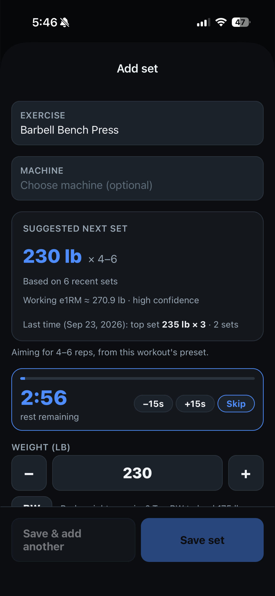
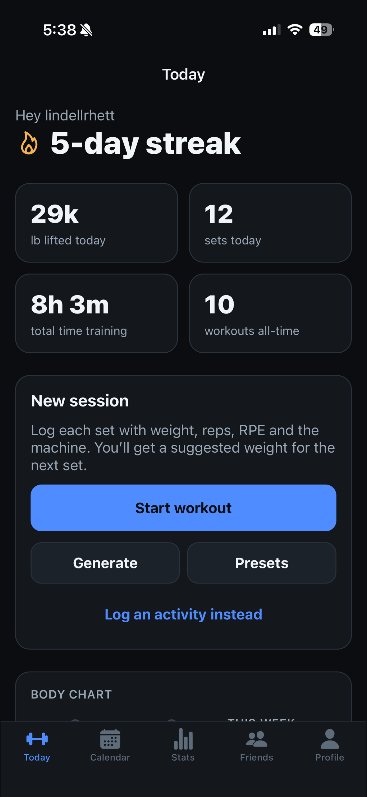
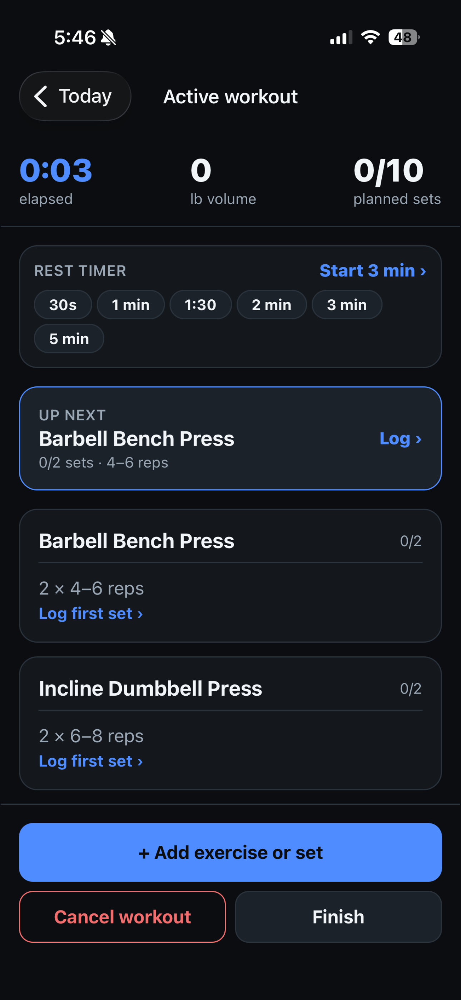
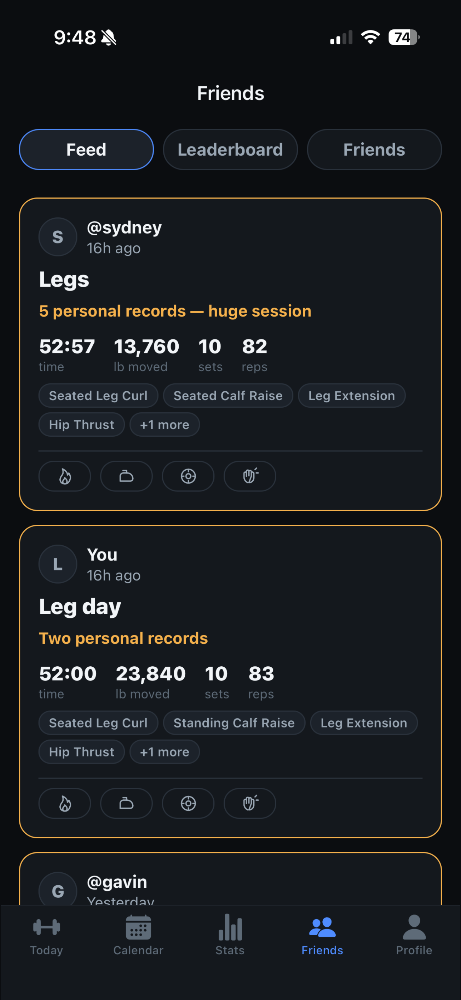

# Rust Strength

**A workout tracker for iPhone that tells you what weight to put on the bar for your next set.**

You log a set with its weight, reps, and how hard it felt. The app estimates
your current strength from your recent sets and suggests the load for the next
one. Over time it learns your gym's machines too, so a PR on one cable stack
carries over to a differently labeled one.

**Status:** [live on the App Store](https://apps.apple.com/us/app/rust-strength/id6811736131) since October 2, 2026, after beta
testing on TestFlight · **Role:** solo developer · **Built:** September 2026

<p align="center">
  
  
  
  
</p>

---

## For employers and reviewers

Hi, I'm Rhett Lindell, a Computer Science student (Cybersecurity minor) at the
University of North Dakota, graduating May 2029. I'm looking for internships in
AI development, software engineering, or cybersecurity.

[Portfolio](https://lindellrhett-gif.github.io/) ·
[Résumé](https://lindellrhett-gif.github.io/resume.html) ·
[LinkedIn](https://www.linkedin.com/in/rhett-lindell) ·
[lindellrhett@gmail.com](mailto:lindellrhett@gmail.com)

### At a glance

| | |
|---|---|
| **Scope** | A full iOS app, from the database to the App Store submission, built solo |
| **Timeline** | First commit September 7, 2026; submitted to the App Store September 27, 2026; released October 2, 2026 |
| **App code** | About 19,600 lines of TypeScript across the screens, components, domain logic and data layer |
| **Database** | About 3,000 lines of SQL in 14 migrations, including tables, Row Level Security policies and server functions |
| **Tests** | 519 Jest tests in 36 suites, plus strict TypeScript and ESLint |
| **Tools** | Git, EAS Build, TestFlight, and Claude Code for AI-assisted development |
| **Users** | Beta tested on TestFlight, now [on the App Store](https://apps.apple.com/us/app/rust-strength/id6811736131) |

### A five-minute code tour

If you only open a few files, open these:

| What it shows | Where to look |
|---|---|
| **Algorithm design:** the next-set weight recommender (estimated one-rep max, smoothing, safety limits) | [`src/domain/recommender.ts`](src/domain/recommender.ts) · [tests](__tests__/recommender.test.ts) |
| **Working from real data:** learning the conversion between two gym machines from paired sessions | [`src/domain/machines.ts`](src/domain/machines.ts) · [tests](__tests__/machines.test.ts) |
| **Database security:** friendships, and profiles only visible to friends, enforced by Row Level Security | [`supabase/migrations/0002_milestone2.sql`](supabase/migrations/0002_milestone2.sql) |
| **A privacy fix and a performance fix** found in my own pre-launch review | [`supabase/migrations/0009_feed_hardening.sql`](supabase/migrations/0009_feed_hardening.sql) |
| **Advanced SQL:** streaks and consistency calculated on the server with a gaps-and-islands query | [`supabase/migrations/0014_streaks_friend_time.sql`](supabase/migrations/0014_streaks_friend_time.sql) |
| **Offline-first sync:** writes queued in order and replayed when the connection returns | [`src/data/mutationDefaults.ts`](src/data/mutationDefaults.ts) · [`src/data/workouts.ts`](src/data/workouts.ts) |
| **Debugging an auth race:** holding data requests until an expired session refreshes | [`src/lib/sessionGuard.ts`](src/lib/sessionGuard.ts) · [`src/lib/supabase.ts`](src/lib/supabase.ts) |
| **One source for legal text:** the Privacy Policy and Terms generated for the app and the website from the same code | [`scripts/build-legal.js`](scripts/build-legal.js) |

### Problems I solved

- **"Workout not found" after an hour away.** While the app sat in the
  background, the sign-in token expired, so requests went out with only the
  public key. Row Level Security then correctly returned nothing. A fetch guard
  now holds those requests until the session refreshes, and retries them with
  backoff.
- **A friend's workout time showing 23 hours instead of 2.** A SQL query joined
  sets before adding up session lengths, so each workout was counted once per
  set. I split the totals into separate lateral joins.
- **Users unable to confirm their email.** Some email security filters open
  links to scan them, which can use up a single-use confirmation link before
  the user taps it. Sign-up and password reset now use 6-digit codes instead.
- **Getting stronger looked like a machine difference.** The first
  machine-ratio model paired a new personal record with an older session on the
  other machine. Pairing each session only with its nearest counterpart inside a
  time window fixed it, and there are tests for it.

### Run the tests

The core logic is pure TypeScript, so the tests need no database or phone:

```bash
npm install
npm test
```

---

## Features

**Training**
- **Next-set weight suggestions** from your recent history, aimed at the rep
  range you set for that exercise.
- **Machine-aware recommendations.** The app keeps each machine's history
  separate and learns the conversion between two machines from sessions done
  close together.
- **Four exercise types:** weighted, bodyweight (with added weight), assisted
  (like an assisted pull-up machine), and **timed holds** with a built-in
  countdown timer and suggested hold times.
- **Rest timer** that starts when you save a set, with a notification when rest
  is over, even with the phone locked.
- **Presets** with a rep range per exercise, and a **workout generator** that
  builds a session from your equipment and what you have not trained this week.
- **Review screen** after each workout to fix the name, the length, or any
  mistyped set.
- **200+ built-in exercises**, plus your own.
- **Activities** such as runs and classes, timed live or entered to the second.

**Progress**
- Streaks, 30-day consistency, volume, time trained, and personal records.
  Planned rest days keep a streak alive without adding to it.
- A progress chart per exercise, and a body chart of what you trained this week.
- Levels, trophies, and badges.

**Friends**
- Friend requests by username, and a **feed** of friends' finished sessions
  with reactions.
- A **leaderboard** ranking you and your friends by streak, weight lifted,
  workout time, consistency, and activity time, over a chosen period.
- Blocking, reporting, and a switch to stop sharing your workouts.

**Reliability and privacy**
- **Works offline.** Sets logged with no signal are queued and sync when the
  connection returns. Nothing is lost if the app is closed mid-workout.
- **Download all your data** or **delete your account** from inside the app.

---

## Running (version 1.1, in development)

GPS run tracking, built into the same app: runs are activities, so they
appear in the Calendar, the friends feed, Stats and the streak.

- **Recording:** a full-screen recorder with a countdown, the time,
  distance, current and average pace, and the route drawn live on Apple
  Maps. It keeps recording with the screen locked, survives the app being
  closed mid-run (reopening offers Resume, Finish or Discard), and counts
  steps and cadence from the phone's motion sensors.
- **Lock Screen and Dynamic Island:** the time, distance and pace stay in
  view with the phone locked (an iOS Live Activity, drawn by a SwiftUI widget
  extension). iOS ticks the clock itself, so the app only sends an update when
  something else changes, and if the app is closed mid-run the activity says
  it has stopped updating instead of counting on.
- **Auto-pause** goes by the phone's own speed reading, so the clock holds
  the moment you stop at a light and starts again as you move off. Losing
  signal in a tunnel doesn't pause it.
- **Spoken updates** every mile or kilometre, which lower your music while
  they talk.
- **Run summary:** map, splits, best efforts inside the run, pace and
  elevation charts, effort and notes. Runs can be edited, deleted, and
  trimmed at either end (everything is worked out again from the part
  kept).
- **History:** weekly and monthly distance, a weekly goal, records for the
  mile, 5K, 10K, half and marathon, and a calendar of runs.
- **Saved routes:** save a run's route, run it again with the route drawn
  on the map, and compare every attempt.
- **Sharing:** friends see distance, time and pace by default. The map is
  shared only if you turn it on for a run, and the server always removes
  the first and last 200 m and anything inside your privacy zones before
  anyone else sees it.
- **Manual entry** for treadmill runs and runs without the phone.

| Where to look | What it shows |
|---|---|
| [`src/domain/running/filter.ts`](src/domain/running/filter.ts), [`stops.ts`](src/domain/running/stops.ts) | Cleaning GPS: accuracy, spikes, jitter, and auto-pause from the phone's speed reading |
| [`__tests__/runningAutoPause.test.ts`](__tests__/runningAutoPause.test.ts) | Simulated runs replayed second by second, as the screen sees them |
| [`supabase/migrations/0021_run_sharing.sql`](supabase/migrations/0021_run_sharing.sql) | Server-side trimming of shared routes with privacy zones (PostGIS) |
| [`supabase/tests/sharing.test.mjs`](supabase/tests/sharing.test.mjs) | Proving a shared outline never comes within a privacy zone |
| [`targets/widget/`](targets/widget), [`modules/run-activity/`](modules/run-activity) | The Live Activity in Swift: the widget that draws it and the small native module that starts and updates it |

**Permissions.** Location "While Using the App" when a run starts (never
"Always"), with background location updates while recording; Motion &
Fitness for steps. The Info.plist strings live in `app.json` (the
`expo-location` and `expo-sensors` plugins), `UIBackgroundModes` is
`location` and `audio`, and `NSSupportsLiveActivities` turns on the Lock
Screen view, which needs no permission (people can turn it off in Settings).

**Battery.** GPS at its most accurate setting is the main cost, and it runs
only between Start and Finish. I haven't measured the drain per hour on a
real run yet. Every fix is kept (about one a second), because a distance
filter saves little power while the GPS is on and would hide stops. With the
phone locked the recording screen does no work at all; with it on, the track
is cleaned once per new fix and redrawn every 2 to 5 seconds on runs over an
hour.

---

## Tech stack

| Layer | Tools |
|---|---|
| App | TypeScript, React Native 0.86, React 19, Expo SDK 57, Expo Router |
| Data and sync | TanStack Query v5 with a persisted offline cache and queued writes, supabase-js |
| Backend | Supabase: PostgreSQL, Auth, Row Level Security, SQL functions |
| Forms and validation | React Hook Form, Zod |
| Graphics | react-native-svg for charts and the body chart |
| Testing and quality | Jest with ts-jest (36 suites, 519 tests), ESLint, strict TypeScript |
| Release | EAS Build and EAS Submit, TestFlight, App Store Connect |
| Website | Static HTML generated by a Node script and hosted on GitHub Pages |

---

## How it works

### The recommender

The core logic lives in [`src/domain/recommender.ts`](src/domain/recommender.ts).
It is pure TypeScript with no React or network code, so it is fully unit
tested.

1. **Estimate strength from each set.** How hard the set felt (RPE) becomes
   reps left in reserve. Weight and reps-to-failure go into the Epley formula
   to estimate a one-rep max (e1RM). Reps are capped at 12 in the formula,
   because the estimate stops being reliable for long sets.
2. **Smooth the estimate.** An exponential moving average over the last six
   working sets, so one great or terrible day does not swing the next
   suggestion.
3. **Pick the next load.** The formula is run backwards for the target rep
   range, nudged by the last set's RPE, limited to a 15% change from last
   time, and rounded to what that machine or bar can actually load.

Timed holds use a separate, simpler model that works in 5-second steps.

### Learning machines

Two cable stacks in the same gym can be labeled completely differently, so
50 lb on one is 100 lb on another. [`src/domain/machines.ts`](src/domain/machines.ts)
learns that ratio automatically:

- It pairs sessions of the same exercise on the two machines that were done
  within 14 days of each other. Each session is matched only to its closest
  counterpart, so getting stronger over time is not mistaken for a difference
  between machines.
- It takes the **median** ratio of the 12 most recent pairs, which ignores one
  odd session.
- Before suggesting a weight, it converts history from the other machine using
  that ratio. A new PR on machine 1 moves the suggestion on machine 2.

### Offline-first sync

Gym basements have bad signal, so the app is built to work without it.

- TanStack Query's cache is saved to device storage, so the app opens with your
  data straight away.
- Writes are queued in order (start workout, then add a set, then finish) and
  replayed when the connection returns.
- A custom fetch guard stops the app sending a data request while its sign-in
  session is still refreshing. Without it, returning after an hour away could
  show "workout not found". Requests retry with backoff instead.

### Security and privacy

Every table has **Row Level Security** turned on, so the database itself
refuses requests for anyone else's data, whatever the app sends.

- Your own rows are only reachable by you (`user_id = auth.uid()`).
- Anything that reads another person's data runs through a SQL function that
  checks, inside the database:
  - you are accepted friends,
  - they have sharing turned on,
  - neither of you has blocked the other.
- Friends only ever get **summaries**: a finished session's totals, leaderboard
  figures, and records. The set-by-set log of a workout never leaves the server.
- Reaction rows are readable only by the person who left them, so the database
  enforces the Privacy Policy's promise that you see counts, not names.
- Badges have no write policy at all. Only an admin can award one, so nobody can
  grant themselves "Influencer" through the API.
- Sign-up and password reset use one-time email codes.
- The only key in the app is Supabase's public anon key. There is no service
  role key anywhere in the app.

### Legal and store readiness

The Privacy Policy and Terms are written in [`src/legal/`](src/legal). One
script ([`scripts/build-legal.js`](scripts/build-legal.js)) generates both the
in-app screens and the public website from that source, so the two can never
say different things. The app also includes account deletion inside the app,
a data export, age confirmation, and a user-content moderation workflow for
reported users.

---

## Project layout

```
app/                 Screens, routed by file with Expo Router
  (auth)/            Sign in, sign up, email code, password reset
  (tabs)/            Today, Calendar, Stats, Friends, Profile
  workout/           Active workout, review, summary
  set/new.tsx        Add-set screen with the live suggestion
  run/               Recorder, run summary, editing, history hub, routes
src/
  domain/            Pure, unit-tested logic: recommender, machines, streaks,
                     leaderboard, generator, XP, and more
    running/         GPS cleaning, auto-pause, splits, best efforts, charts
  data/              TanStack Query hooks over Supabase
  components/        Shared UI, the hold timer, charts
  lib/               Supabase client, session guard, query client
  legal/             Privacy Policy and Terms source
supabase/
  migrations/        Schema, RLS policies and SQL functions (0001 to 0023)
  tests/             Migrations run in PGlite, with RLS checked as each user
  email-templates/   Code-based sign-up and reset emails
modules/run-activity/  Local native module (Swift) for the run's Live Activity
targets/widget/      Widget extension (SwiftUI) that draws it, added at prebuild
__tests__/           Jest specs
scripts/             Legal site, icon and screenshot generators
```

## Running it locally

See **[SETUP.md](SETUP.md)**.

---

## My role

I built Rust Strength on my own:

- **Product and design:** chose the features, designed the screens, and worked
  through feedback from TestFlight testers.
- **Architecture:** chose the stack, designed the Postgres data model, and
  planned the offline sync.
- **Security:** wrote the Row Level Security policies and permission-checked
  SQL functions.
- **Algorithms:** built the weight recommender and the machine-conversion
  learning, both with unit tests.
- **Launch:** handled the builds, TestFlight, and App Store submission, plus the
  privacy policy, terms, and account deletion that App Review requires.

### How I used AI tools

I used Claude Code as a development tool, and it wrote a large share of the
implementation. That is how one person took a full app from first commit to
App Store submission in three weeks. The engineering decisions stayed with me:

- **I set the structure first.** I designed the data model, the Row Level
  Security rules, the offline sync approach, and how the recommender should
  behave, then had Claude Code build against that design one piece at a time.
- **I reviewed every change.** Nothing went in until I had read it and tested
  it. When something was wrong, I diagnosed the cause and directed the fix;
  [Problems I solved](#problems-i-solved) has examples.
- **Tests are the guardrail.** The core logic is pure TypeScript covered by 519
  Jest tests, under strict TypeScript and ESLint, so generated code has to pass
  the same checks as anything I write by hand.
- **I audited it before launch.** My own pre-launch review of the database found
  a privacy issue and a performance issue, both fixed in
  [`0009_feed_hardening.sql`](supabase/migrations/0009_feed_hardening.sql).

AI tools let me move faster; owning the design and verifying the output is what
makes the result reliable. I'm happy to walk through any part of the code.

**Links:** [Portfolio](https://lindellrhett-gif.github.io/) ·
[Support and legal pages](https://lindellrhett-gif.github.io/rust-strength/) ·
[GitHub](https://github.com/lindellrhett-gif)
